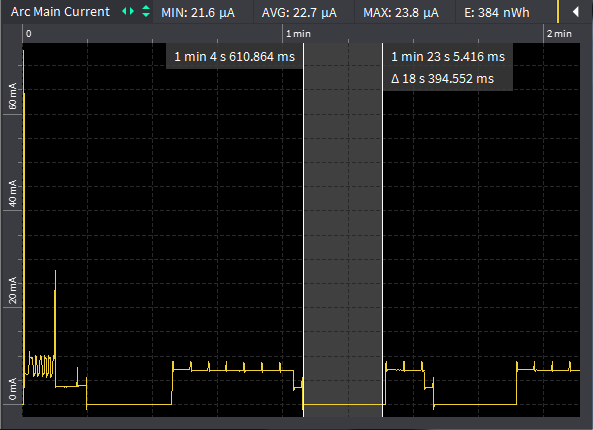
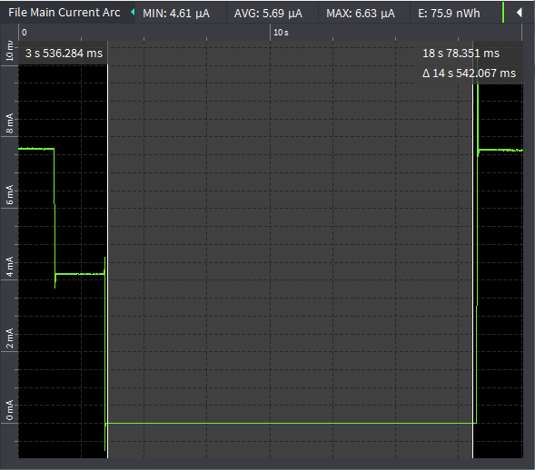

# stm32l0_pwrtest

This is a simple test program for experimenting with and verifying power management on STM32L0 boards.

<!-- TOC depthFrom:2 updateOnSave:true -->

- [Building](#building)
- [Setup with 4801](#setup-with-4801)
- [Commands](#commands)
	- [`help`](#help)
	- [`r`: read registers](#r-read-registers)
	- [`sleep`](#sleep)
	- [`standby`](#standby)
	- [`stop`](#stop)
	- [`w`: write registers](#w-write-registers)
- [System commands](#system-commands)
	- [`cpuid`](#cpuid)
	- [`echo`](#echo)
	- [`fram dump`](#fram-dump)
	- [`fram reset`](#fram-reset)
	- [`system configure`](#system-configure)
	- [`system reset`](#system-reset)
- [Sleep power consumption](#sleep-power-consumption)
	- [Catena 4612](#catena-4612)
	- [Catena 4801](#catena-4801)

<!-- /TOC -->

## Building

This program requires the [Catena-Arduino-Platform](https://github.com/mcci-catena/Catena-Arduino-Platform) (and the associated libraries).

It's easier to do testing on the Catena 4801.

## Setup with 4801

1. Attach an ST-LINK-2 to the SWD pins of the 4801 using jumpers.

   .

   | 4801 Pin |  Label | ST-Link Pin |
   |:--------:|:------:|:-----------:|
   |   JP1-1  |  +VDD  |      1      |
   |   JP1-2  |   GND  |      3      |
   |   JP1-3  | SWDCLK |      9      |
   |   JP1-4  | SWDIO  |      7      |
   |   JP1-5  |  nRST  |     15      |

   Note that these are almost linear; only 9 and 7 on the ST-Link are swapped.

2. Attach an Adafruit FT232H USB to TTL serial adapter.

   | 4801 Pin |  Label |    FT232H   |
   |:--------:|:------:|:-----------:|
   |   JP4-2  |   D0   |      D0     |
   |   JP4-3  |   D1   |      D1     |

3. Connect the serial adapter to PC via USB.  Ensure (in device manager) that the FTDI driver is creating a COM port. Use TeraTerm and open the COM port. In Setup>Serial, set speed to 115200. In `Setup>Terminal`:

   1. Set `New-line Receive:` to `LF`,
   2. Set `New-line Transmit:` to `CR+LF`,
   3. Make sure to check `Local echo`.

4. Attach power using a OTII box.

   | 4801 Pin |  Label |   OTII Pin  |
   |:--------:|:------:|:-----------:|
   |   JP6-1  |   GND  |     BLK     |
   |   JP6-2  |  +VDD  |     RED     |

5. Launch OTII software and set power to 3.3V, 200 mA limit.

## Commands

### `help`

Displays a terse list of commands.

### `r`: read registers

Read and display one or more registers. The first argument is the base register address. If there's no second argument, then only one 32-bit word is read and displayed. Othersise, the second argument is the number of words to read and display.

Both base and length are given in hexadecimal.

### `sleep`

This command uses the `CatenaRTC::Sleep()` method to suspend the system. If an argument is provided, it gives the sleep time in seconds. Otherwise, the system sleeps for 5 seconds.  The delay is given in decimal.

### `standby`

Not implemented.

### `stop`

Not implemented.

### `w`: write registers

Write values to successive registers. The first argument is the base address, which must be 32-bit aligned. Subsequent arguments are taken as the 32-bit values to be written.

Both base and the values are given in hexadecimal.

## System commands

These commands are supplied by the framework

### `cpuid`

Read and display the CPU ID.

### `echo`

Print the arguments to the consoles.

### `fram dump`

Dump FRAM.  The first argument is the base, the second (if given) is the number of bytes to display. Both are given in hexadecimal.

### `fram reset`

If given with no arguments, the FRAM is reset in a non-desctructive way. If written as `fram reset hard`, the FRAM is reinitialized by re-writing the header.

### `system configure`

Set one of several system configuration parameters: `syseui`, `operatingflags`, or `platformguid`.

### `system reset`

Reset the system.

## Sleep power consumption

On uploading this power test sketch, we measured the sleep power of Catena 4612 and 4801 using OTII tool.

### Catena 4612

The average sleep power of Catena 4612 is **~23 uA**. The below graph shows the sleep power with minimum, maximum and average values.

.

### Catena 4801

The average sleep power of Catena 4801 is **~7 uA**. The below graph shows the sleep power with minimum, maximum and average values.

.
